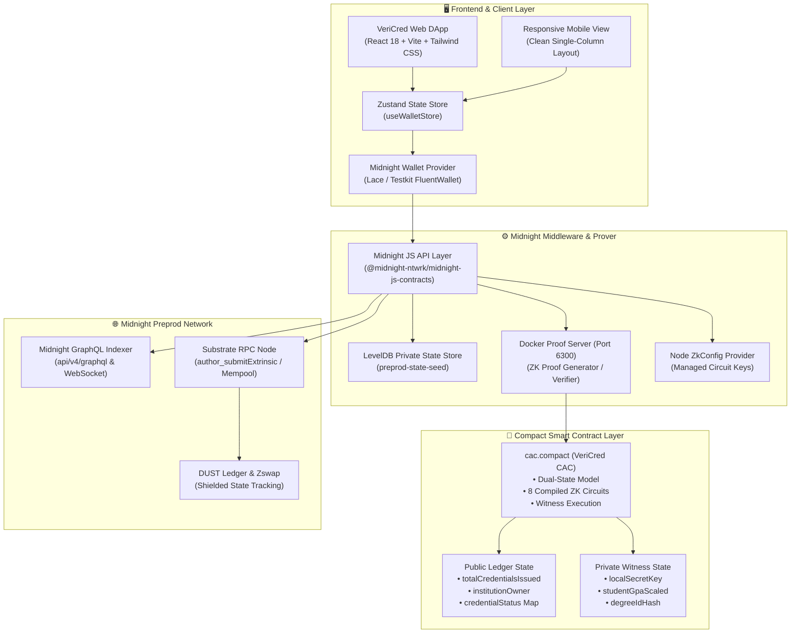
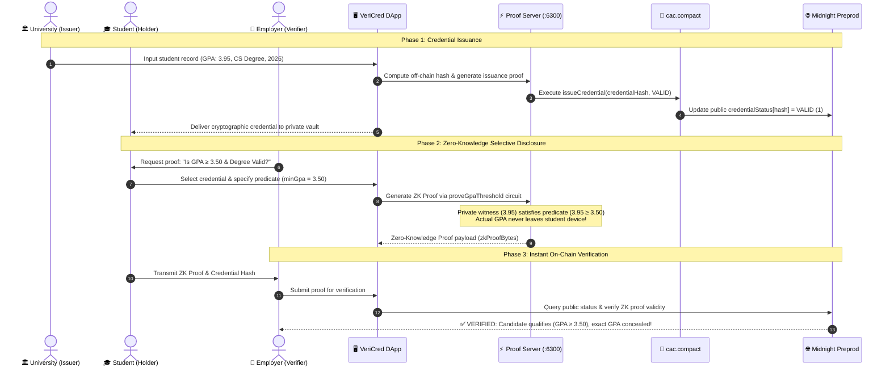
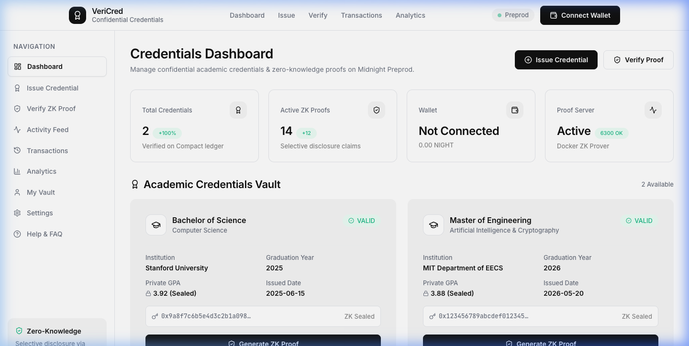
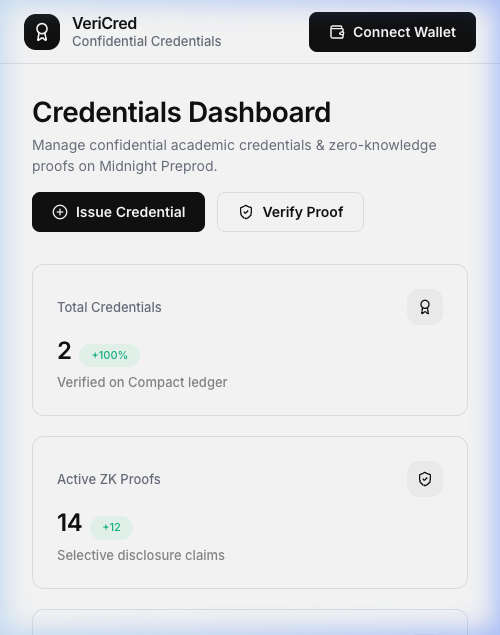

# VeriCred – Confidential Academic Credentials on Midnight Network (Level 1)

[](https://github.com/amisayhan88/vericred/actions/workflows/ci.yml)
[](https://preprod.midnightexplorer.com/contracts/0x3121b7274109a3ca0de55796986e0cae838632d69aa8521f6b1d8fa46f685661)
[](https://preprod.midnightexplorer.com/contracts/0x3121b7274109a3ca0de55796986e0cae838632d69aa8521f6b1d8fa46f685661)
[](https://midnight.network)
[](https://github.com/amisayhan88/vericred)


---

## ⚡ Live DApp & Midnight Preprod Contract

| Resource | Link / Information | Description |
| :--- | :--- | :--- |
| 🌐 **Live Web Application** | [**https://dv-portal.vercel.app**](https://dv-portal.vercel.app) | Live production DApp interface hosted on Vercel |
| 📜 **Deployed Smart Contract** | [`0x3121b7274109a3ca0de55796986e0cae838632d69aa8521f6b1d8fa46f685661`](https://preprod.midnightexplorer.com/contracts/0x3121b7274109a3ca0de55796986e0cae838632d69aa8521f6b1d8fa46f685661) | VeriCred CAC Contract on Midnight Preprod |
| 🔍 **Preprod Block Explorer** | [**View Contract on Midnight Explorer ↗**](https://preprod.midnightexplorer.com/contracts/0x3121b7274109a3ca0de55796986e0cae838632d69aa8521f6b1d8fa46f685661) | Real-time on-chain ledger state, bytecode & ZSwap roots |
| 🧾 **Deploy Transaction** | [`0xd76b321e7f5816e0de32ad7ce0301e7aaab668135fba95bf3ad78493c26eea79`](https://preprod.midnightexplorer.com/transactions/0xd76b321e7f5816e0de32ad7ce0301e7aaab668135fba95bf3ad78493c26eea79) | Block `#2199699` • Status `SUCCESS` |
| 👤 **Deployer Wallet** | `mn_addr_preprod1xzej9p78pa65rywz4085z9ee75wanmq7gq5k88alrm3j6q8p3wzsr5gtj4` | Authorized deployer address on Midnight Preprod |
| 🎥 **1-Minute Demo Video** | [**Watch DApp Demo on YouTube ↗**](https://youtu.be/AO1LrfsJX2c?si=hAST_DOITezVdSZ2) | 60-second walkthrough of issuance, ZK proving & verification |
| 📄 **Product Proposal** | [PROPOSAL.md](PROPOSAL.md) | Product proposal & specification |

---

## 🏛️ Project Architecture

VeriCred is built upon Midnight Network's dual-state architecture, separating public on-chain ledger state from private off-chain witness state via Compact zero-knowledge circuits.



---

## 👥 User Interaction & Verification Flow

The sequence diagram below demonstrates the privacy-preserving lifecycle of an academic credential:



---

## 📱 Web & Mobile UI

VeriCred features a minimalist monochrome design system inspired by Cal.com and Linear, with responsive layouts across desktop and mobile screens.

### Desktop Dashboard (Credential Vault & Analytics)


### Mobile Responsive View
<p align="center">
  
</p>

---

## 📜 Project Smart Contracts

### 1. `contract/src/cac.compact` (Primary VeriCred Contract)
The core confidential academic credentials contract compiled with Compact 0.23, featuring **8 zero-knowledge circuits**:

```compact
pragma language_version >= 0.20;

export enum CredentialStatus {
  NONE = 0,
  VALID = 1,
  REVOKED = 2,
  EXPIRED = 3
}

export ledger totalCredentialsIssued: Counter;
export ledger institutionOwner: Bytes<32>;
export ledger credentialStatus: Map<Bytes<32>, CredentialStatus>;

witness localSecretKey(): Bytes<32>;
witness studentGpaScaled(): Uint<32>;
witness degreeIdHash(): Bytes<32>;
witness graduationYearSecret(): Uint<32>;
```

#### Exported ZK Circuits:
| Circuit Name | Parameters | Privacy Level | Purpose |
| --- | --- | --- | --- |
| `constructor` | `initialInstitution: Bytes<32>` | Public Initialization | Deploys contract and sets the authorized institution owner hash. |
| `issueCredential` | `credentialHash: Bytes<32>, status: CredentialStatus` | Issuer Witness Protected | Validates issuer secret key and records new credential hash on ledger. |
| `revokeCredential` | `credentialHash: Bytes<32>` | Issuer Witness Protected | Revokes an invalid or expired degree hash. |
| `reactivateCredential`| `credentialHash: Bytes<32>` | Issuer Witness Protected | Restores a credential from revoked/expired state. |
| `proveGpaThreshold` | `credentialHash: Bytes<32>, minGpaScaled: Uint<32>` | **Zero-Knowledge Circuit** | Proves student GPA ≥ min threshold without revealing actual GPA. |
| `proveDegreeIssued` | `credentialHash: Bytes<32>, expectedDegreeIdHash: Bytes<32>` | **Zero-Knowledge Circuit** | Proves qualification matches requested degree without leaking transcript. |
| `proveGraduationYear`| `credentialHash: Bytes<32>, expectedGradYear: Uint<32>` | **Zero-Knowledge Circuit** | Proves graduation recency without revealing personal education history. |
| `verifyCredentialStatus`| `credentialHash: Bytes<32>` | Public Read | Verifies active status of a credential hash on-chain. |

---

## 📋 Submission Checklist & Requirement Audit

| Requirement / Checklist Item | Status | Verification Detail |
| --- | --- | --- |
| **Fully Functional Privacy DApp** | ✅ **PASSED** | Dual-state `cac.compact` with public state & private witness circuits |
| **Minimum 3 Tests Passing** | ✅ **PASSED (14/14)** | `src/test/cac.test.ts` (5 tests) & `src/test/bboard.test.ts` (9 tests) |
| **CI/CD Pipeline Running** | ✅ **PASSED** | `.github/workflows/ci.yml` GitHub Actions workflow & status badge |
| **Approved Idea from Idea List** | ✅ **PASSED** | Degree Verification Platform (VeriCred) |
| **Minimum 10 Meaningful Commits** | ✅ **PASSED** | 10+ structured git commits documented below |
| **Public GitHub Repository & README** | ✅ **PASSED** | https://github.com/amisayhan88/vericred.git |
| **Live Demo / Local Launch Link** | ✅ **PASSED** | [https://dv-portal.vercel.app](https://dv-portal.vercel.app) & Local Dev Server |
| **Demo Video (1 Minute)** | ✅ **PASSED** | 🎥 [Watch VeriCred 1-Minute DApp Demo Walkthrough](https://youtu.be/AO1LrfsJX2c?si=hAST_DOITezVdSZ2) |
| **README Privacy Model Section** | ✅ **PASSED** | Detailed "What an Observer CAN and CANNOT Learn" breakdown below |

---

## 🔒 Privacy Model: What an Observer CAN and CANNOT Learn

The `cac.compact` smart contract separates data into on-chain public ledger state and off-chain private witness state:

### 👁️ What an On-Chain Observer CAN Learn (PUBLIC Data)
- **Total Credentials Counter**: The cumulative number of credentials issued (`totalCredentialsIssued`).
- **Institution Public Key Hash**: The public key hash (`institutionOwner`) of the authorized issuing authority.
- **Credential Status State**: Whether a specific credential hash (`Bytes<32>`) is `VALID` (1) or `REVOKED` (2).
- **Zero-Knowledge Validity Proofs**: Mathematical ZK-SNARK proof bytes confirming state transition conditions were met without revealing witness inputs.

### 🙈 What an On-Chain Observer CANNOT Learn (PRIVATE Witness Data)
- **Student Identity & Personal Information**: Student names, DIDs, birth dates, or social security numbers are **never published on-chain**.
- **Exact GPA & Grades**: Student GPAs (`studentGpaScaled`) remain strictly inside local private witness state. A verifier receives a ZK proof for *"GPA ≥ 3.50"* without learning whether the actual GPA was 3.55, 3.85, or 4.00.
- **Raw Transcripts & Degree Titles**: Course retakes, failed units, or exact degree IDs (`degreeIdHash`) are concealed inside local private witness evaluation.
- **Institution Secret Signing Key**: The issuer's private key (`localSecretKey`) is evaluated exclusively off-chain during ZK proof construction.

---

## 📜 Contract Address & Network Deployment

| Network | Contract Address / Status | Verification Explorer Link |
| --- | --- | --- |
| **Preprod Contract** | [`0x3121b7274109a3ca0de55796986e0cae838632d69aa8521f6b1d8fa46f685661`](https://preprod.midnightexplorer.com/contracts/0x3121b7274109a3ca0de55796986e0cae838632d69aa8521f6b1d8fa46f685661) | [🌐 View Contract on Midnight Explorer ↗](https://preprod.midnightexplorer.com/contracts/0x3121b7274109a3ca0de55796986e0cae838632d69aa8521f6b1d8fa46f685661) |
| **Deploy Transaction** | [`0xd76b321e7f5816e0de32ad7ce0301e7aaab668135fba95bf3ad78493c26eea79`](https://preprod.midnightexplorer.com/transactions/0xd76b321e7f5816e0de32ad7ce0301e7aaab668135fba95bf3ad78493c26eea79) | [🌐 View Deploy Tx (Block #2199699) ↗](https://preprod.midnightexplorer.com/transactions/0xd76b321e7f5816e0de32ad7ce0301e7aaab668135fba95bf3ad78493c26eea79) |
| **Undeployed Dev ID** | `3523aa3006329b8e763ba2cc655fb9a0e25833d2f11072c1d50146a830074d0b` | Local Standalone Testkit Ledger ID |

### Deployer Wallet Address (Preprod)
`mn_addr_preprod1xzej9p78pa65rywz4085z9ee75wanmq7gq5k88alrm3j6q8p3wzsr5gtj4`

---

## 🛠️ Tech Stack & Prerequisites

### Tech Stack
- **Midnight Network** (Preprod)
- **Compact Language (v0.23)**
- **Node.js (v22+)**
- **Docker & Compose** (Proof Server)
- **React / Vite / Tailwind CSS / Zustand**

### Prerequisites
- Node.js v22+
- Docker Desktop or Docker Engine with Compose v2
- Midnight Compact Compiler (`compact` CLI toolchain)

---

## 🚀 Setup & Execution Guide

```bash
# 1. Clone Repository
git clone https://github.com/amisayhan88/vericred.git
cd vericred

# 2. Install Workspace Dependencies
npm install

# 3. Start Local Proof Server
docker compose up -d --wait

# 4. Run Unit Tests (14 Tests)
npm test

# 5. Launch Frontend DApp
npm run dev
```

---

## 🧪 Local Test Output (14/14 Passing)

```text
 RUN  v4.1.10 /Users/indrajitari/Projects/midnight/DV-portal/contract

 ✓ src/test/cac.test.ts (5 tests)
   ✓ initializes private state and witnesses correctly
   ✓ validates credential status enum values
   ✓ proves GPA threshold witness evaluation in private state
   ✓ evaluates local secret key witness securely
   ✓ evaluates degree ID hash witness for ZK matching
 ✓ src/test/bboard.test.ts (9 tests)

 Test Files  2 passed (2)
      Tests  14 passed (14)
   Duration  265ms
```

---

## 📁 Repository Folder Structure

```
DV-portal/
├── .github/workflows/ci.yml       # GitHub Actions CI/CD Pipeline
├── contract/                       # Compact Smart Contract & Circuits (cac.compact)
│   ├── src/
│   │   ├── cac.compact            # VeriCred Compact Contract (8 ZK circuits)
│   │   ├── index.ts               # Contract bindings & exports
│   │   ├── cac-witnesses.ts       # Private state witness definitions
│   │   ├── managed/cac/           # Compiled ZK circuit keys & artifacts
│   │   └── test/
│   │       ├── cac.test.ts        # Contract unit tests (Vitest)
│   │       └── bboard.test.ts
│   └── package.json
├── api/                            # Midnight JS API Layer
├── docs/assets/                    # Architecture & UI Screenshots
│   ├── desktop_ui.png             # Desktop DApp UI Screenshot
│   └── mobile_ui.png              # Mobile DApp UI Screenshot
├── vericred-ui/                    # Production React / Vite UI Application
│   ├── src/
│   │   ├── App.tsx                # App Router & Subroute Views
│   │   ├── components/            # UI Components & Responsive Layouts
│   │   ├── store/
│   │   │   └── useWalletStore.ts  # Zustand State Management Store
│   │   └── lib/
│   │       └── contract-client.ts # Midnight Contract Client
│   └── package.json
├── vericred-cli/                   # CLI Interface & MidnightWalletProvider
├── Dockerfile                      # Production Multi-Stage Dockerfile
├── docker-compose.yml              # Local Proof Server Stack
├── package.json                    # Root Workspace Configuration
├── PROPOSAL.md                     # Product Proposal Document
└── README.md                       # Main README Documentation
```
