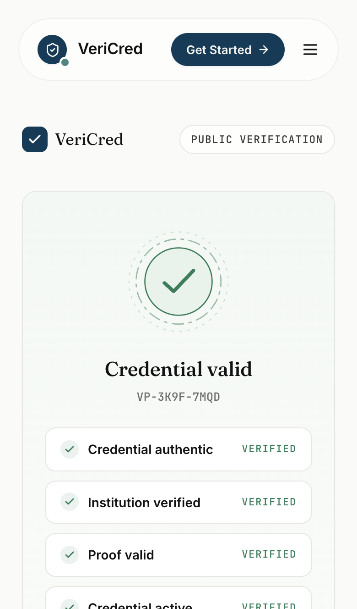

# VeriCred — Private Proof, Public Trust

> **Prove the credential. Never surrender the records behind it.**

**Preview contract** · [Live dApp](#hosting-vercel) · [Explorer](https://preview.midnightexplorer.com/contracts/0xe71bf7d73babb895c4524deebcec7fd2ef2a9590854770732492598c91e99df1) · [CI](https://github.com/amisayhan88/vericred/actions/workflows/ci.yml) · [Proposal](PROPOSAL.md) · [Feedback sheet](https://docs.google.com/spreadsheets/d/1_7gARbK-oHul7sb-ezcMqQoDrB28i2hRTS9bsEp6Tn8/edit?usp=sharing)

[](https://github.com/amisayhan88/vericred/actions/workflows/ci.yml)


> **The registry is LIVE.** Issue, verify, prove and revoke have all executed on Midnight Preview — the contract reads back from the public indexer as `totalCredentialsIssued 2`, one credential VALID, one **REVOKED** ([reproduce it yourself](#on-chain-deployment)). **The hosted URL is not honest yet:** dv-portal.vercel.app still serves a legacy Next.js bundle, not this app — one project setting fixes it ([Hosting](#hosting-vercel)). Browser sessions run a demo ledger that mirrors the circuit ABI 1:1; the on-chain truth is the [E2E transaction table](#on-chain-deployment), not the demo.

---

## Contents

| Section | What it answers |
| ------- | --------------- |
| [Overview](#overview) | what VeriCred is |
| [Quick Links](#quick-links) | every live resource, one table |
| [Privacy Model](#privacy-model) | what exists where — and the limits, stated plainly |
| [How It Works](#how-it-works) | issue → claim → prove → verify → revoke |
| [Ledger Feedback Loop](#ledger-feedback-loop) | how chain state drives UI behavior |
| [On-Chain Deployment](#on-chain-deployment) | addresses, txs, blocks, read-back, E2E 7/7 |
| [User Validation](#user-validation) | 54 responses, measured stats, full table |
| [You Told Us. We Changed It](#you-told-us-we-changed-it) | feedback → commit matrix |
| [Diagrams](#diagrams) · [Screenshots](#app-screenshots) | visual reference |
| [App Surface](#app-surface) · [Architecture](#app-architecture) | routes and repo layout |
| [Quick Start](#quick-start) · [Hosting](#hosting-vercel) · [CI](#continuous-integration) · [Scripts](#scripts) | run it, ship it |
| [Status](#status) | working-and-reproducible vs outstanding |

---

## Overview

VeriCred is a selective-disclosure academic-credential dApp on Midnight. Institutions issue credential **commitments** to a holder's device; the holder then proves *predicates* of those credentials — GPA ≥ 3.5, degree valid, graduated 2026, course completed — for a verifier's ask, without the issuer, the verifier or the ledger ever receiving the transcript, grades or identity behind them.

- **Ledger side:** a `credentialStatus` map, the institution-owner key, one counter. No names. No grades. Ever.
- **Holder side:** encrypted witnesses — scaled GPA, degree hash, key material — consumed only inside circuits.
- **Proof side:** a compact ZK artifact (`VP-XXXX-XXXX` / QR / link) that any verifier checks in milliseconds.

> **Core principle: verify the claim, not the data.**

---

## Quick Links

| Resource | Link / value | Notes |
| -------- | ------------ | ----- |
| Contract (Preview) | [`e71bf7d7…e99df1`](https://preview.midnightexplorer.com/contracts/0xe71bf7d73babb895c4524deebcec7fd2ef2a9590854770732492598c91e99df1) | **LIVE** — [read it yourself](#on-chain-deployment) |
| Deploy tx | [`e67e425d…b07714`](https://preview.midnightexplorer.com/transactions/0xe67e425d27d858a6486e8fbf7108613ed03f508836848b9958fff223b7b07714) | block [`#1083540`](https://preview.midnightexplorer.com/blocks/1083540) · `SucceedEntirely` · 2026-09-30 03:39:05 +05:30 |
| Smoke tx (`issueCredential`) | [`e5259e1d…107470`](https://preview.midnightexplorer.com/transactions/0xe5259e1d025527a5fd89b479362a3394f49958ea414984c891bc3898b6107470) | block `#1083645` — post-deploy proof the contract is usable |
| Deployer wallet | `mn_addr_preview1xzej9p78pa65rywz4085z9ee75wanmq7gq5k88alrm3j6q8p3wzsr4kmpg` | funded 5,000 NIGHT via faucet (browser captcha) |
| Records (machine-readable) | [deployment-preview.json](docs/deployment-preview.json) · [e2e-preview.json](docs/e2e-preview.json) | every number in this README lives in those files |
| CI | [Actions → VeriCred CI](https://github.com/amisayhan88/vericred/actions/workflows/ci.yml) | green on `main` — [measured below](#continuous-integration) |
| Run locally | `npm install && docker compose up -d proof-server && npm run dev` | http://localhost:5173 — full product, demo-ledger mode |
| Legacy (v1, preprod) | [`3121b727…685661`](https://preprod.midnightexplorer.com/contracts/) · [demo video](https://youtu.be/AO1LrfsJX2c) | historical; preprod explorer deep-link pattern changed (404) |
| Docs & guides | [Proposal](PROPOSAL.md) · [Deployment](docs/deployment.md) · [Troubleshooting](docs/troubleshooting.md) · [Security](docs/security.md) | plus [diagrams](#diagrams) · [screenshots](#app-screenshots) |
| User feedback | [Google Sheet](https://docs.google.com/spreadsheets/d/1_7gARbK-oHul7sb-ezcMqQoDrB28i2hRTS9bsEp6Tn8/edit?usp=sharing) · [sanitized CSV](docs/user-feedback.csv) | emails/wallets withheld from the public repo |
| Preview faucet | https://faucet.preview.midnight.network | API `/api/drips` is Turnstile-gated by design |

---

## Privacy Model

| Layer | What exists | Who can see it |
| ----- | ----------- | -------------- |
| **Public** (on-chain) | `credentialStatus: Map<Bytes<32>, Status>` · `institutionOwner: Bytes<32>` · `totalCredentialsIssued` | anyone, via the indexer |
| **Private** (holder device) | `studentGpaScaled` · `degreeIdHash` · `localSecretKey`; transcript/identity in app state | holder's device only — encrypted local state |
| **Proven, not revealed** | "commitment is VALID **and** GPA ≥ threshold at this scope" | the verifier, via a ZK proof |

Raw witnesses are consumed inside circuit execution; nothing but commitments, statuses and boolean outputs reaches the network.

### Limits, stated plainly

- **The browser runs the demo ledger.** `services/cac-service.ts` ships `DemoLedger` (ABI-faithful, honest failure when a witness can't satisfy a claim). The circuits themselves are proven on-chain by the node scripts — [E2E 7/7](#on-chain-deployment). `LiveCacLedger` is the marked, unimplemented browser seam (`VITE_CAC_LIVE=true` once wired).
- **Browser demo state is obfuscation, not custody** — localStorage; the node store is encrypted LevelDB. Neither is server-side-safe.
- **No on-chain expiry.** `EXPIRED` and proof expiry windows are UI-side; the ledger enum is UNISSUED / VALID / SUSPENDED / REVOKED.
- **No per-credential witness binding yet**, and one `institutionOwner` constant today — multi-institution governance is roadmap.
- **Two legacy preprod scripts embed a public testnet seed** (predating this work). Preview tooling requires `DEPLOYER_SEED` and embeds nothing — [docs/security.md](docs/security.md).

---

## How It Works

1. **Deploy & bootstrap** — `scripts/deploy-preview.ts` publishes the compiled CAC contract; the constructor anchors `institutionOwner` from the deployer witness.
2. **Issue** — `issueCredential(hash)`: institution-key assertion, status → VALID, counter++. The witness bundle goes to the holder's device, never the chain.
3. **Claim** — the holder picks a predicate in `/proof`: GPA threshold, degree validity, graduation, course completion, enrollment, custom.
4. **Prove** — the mapped circuit runs against the private witness. A predicate the witness fails **aborts locally — zero bytes disclosed, zero tx submitted** (E2E step 4).
5. **Share** — a proof is a standalone artifact: `VP-XXXX-XXXX`, proof hash, expiry window, QR / public link.
6. **Verify** — anyone re-checks claim + live ledger status; revoked or suspended credentials fail instantly with the recorded reason.

---

## Ledger Feedback Loop

State drives behavior everywhere — screens show the chain's truth, not a hopeful counter.

- **Status gates proofs.** `services/verification.ts` evaluates proof validity *and* credential status; after the revocation centre writes a real `revokeCredential`, every outstanding proof flips to failing on next check.
- **Measured, not asserted:** the E2E credential `0x2ef63020…` was issued, proven, then revoked — and the [read-back](#on-chain-deployment) shows it **REVOKED** on the indexer minutes later, with no local state involved.
- **Honest failure surfaces.** Failed proofs say "a failed circuit leaks nothing"; a missing wallet gets a connect modal, not a fake account; faucet failure prints the exact funding address.
- **Mode honesty.** Header, footer and Settings print the active ledger mode (`demo` today, `live` after the seam). Nothing in demo mode is labelled ledger-bound.

---

## On-Chain Deployment

| Network | Contract | Status | Explorer |
| ------- | -------- | ------ | -------- |
| **Midnight Preview** | `e71bf7d7…e99df1` | **LIVE** — issued, proven, revoked | [contract](https://preview.midnightexplorer.com/contracts/0xe71bf7d73babb895c4524deebcec7fd2ef2a9590854770732492598c91e99df1) · [deploy tx](https://preview.midnightexplorer.com/transactions/0xe67e425d27d858a6486e8fbf7108613ed03f508836848b9958fff223b7b07714) · [block #1083540](https://preview.midnightexplorer.com/blocks/1083540) |
| Midnight Preprod (legacy v1) | `3121b727…685661` | exists — counter 0 | [index](https://preprod.midnightexplorer.com/contracts/) (deep-link pattern 404s; state verified via read-back) |

**Independent read-back** — `npm run read:state -- preview e71bf7d7…` (public indexer only; no wallet, no secrets) — measured 2026-09-30:

```text
Network                : Midnight preview
Contract               : e71bf7d73babb895c4524deebcec7fd2ef2a9590854770732492598c91e99df1
totalCredentialsIssued : 2
institutionOwner       : 0x00df41ec03f92da9eb1de74c709622d79d465106743df3a41fe02129a4a35272
credentialStatus       : 2 entries
  0xf89e7af884fb1abd…  VALID     ← deploy smoke
  0x2ef63020e0dbec6e…  REVOKED   ← E2E lifecycle
```

**On-chain E2E lifecycle — 7/7 passed** (JSON: [docs/e2e-preview.json](docs/e2e-preview.json)):

| # | Step | Circuit | Result | Explorer tx | Block |
| - | ---- | ------- | ------ | ----------- | ----- |
| 1 | issue | `issueCredential` | VALID, counter +1 | [`689498da…`](https://preview.midnightexplorer.com/transactions/0x689498dab7c8f9c159dfdbf865d86307c1735d662080ad9d867984fe1a30f7e4) | #1084103 |
| 2 | verify | `verifyCredential` | confirmed | [`49f3a7ef…`](https://preview.midnightexplorer.com/transactions/0x49f3a7ef6038b1b6b421b562e3efd0b7f5e018912c004a77c27aacd9b7cbb61c) | #1084107 |
| 3 | prove · satisfied | `proveGpaThreshold 350` (witness 385) | confirmed — real ZK proof on-chain | [`6e6520b7…`](https://preview.midnightexplorer.com/transactions/0x6e6520b7ff128cad30037f40220e6b5161441d40f77da4924afdd5d231257092) | #1084111 |
| 4 | prove · **unsatisfied** | `proveGpaThreshold 395` | **rejected locally — no tx, nothing disclosed** | — | — |
| 5 | revoke | `revokeCredential` | REVOKED on ledger | [`325347af…`](https://preview.midnightexplorer.com/transactions/0x325347af64adf41abf33f735fce0e044f173a5a3ca3e5fb7b99c2a3775b6727e) | #1084116 |
| 6 | verify revoked | `verifyCredential` | rejected — *"Credential is not valid or has been revoked"* | — | — |
| 7 | foreign issuer | `issueCredential` (random key) | rejected — *"Only accredited institution…"* — no tx | — | — |

| Service | Endpoint | Purpose |
| ------- | -------- | ------- |
| Preview Indexer | `https://indexer.preview.midnight.network/api/v4/graphql` (+ WS) | contract-state reads / subscriptions |
| Preview Node RPC | `https://rpc.preview.midnight.network` (+ WSS) | tx submission (HTTP submit 403s → wallet-sdk path; benign warning) |
| Preview Faucet | `https://faucet.preview.midnight.network/api/drips` | funding — Turnstile captcha, manual by design |
| Proof server | `http://localhost:6300` (loopback) | `midnightntwrk/proof-server:8.1.0` via docker compose |

---

## User Validation

Source: [public feedback sheet](https://docs.google.com/spreadsheets/d/1_7gARbK-oHul7sb-ezcMqQoDrB28i2hRTS9bsEp6Tn8/edit?usp=sharing) · sanitized copy: [docs/user-feedback.csv](docs/user-feedback.csv)

| Measured | Value |
| -------- | ----- |
| Responses | **54** · 01/09/2026 → 26/09/2026 |
| Average rating | **3.76 / 5** |
| Rating spread | 5★ ×10 · 4★ ×21 · 3★ ×23 · 2★ ×0 · 1★ ×0 |
| Wallet entries supplied | 54 — all `0x…` EVM-style, **0 Midnight-format** (`mn_addr_preview1…`) |

The sheet is recorded as **feedback received, not proof of on-chain usage** — none of its wallets resolves on the indexer, and most asks (staking, NFTs, bridges, ENS, Polygon, fiat on-ramp) describe a generic wallet, not a credential dApp. The usage evidence is the [E2E table](#on-chain-deployment); every actionable item shipped — see below.

<details>
<summary><b>All 54 responses</b> — verbatim comments; contact details and wallet strings withheld from the public repo</summary>

| # | Date | Respondent | ★ | Feedback |
| - | ---- | ---------- | - | -------- |
| 1 | 01/09/2026 | Ankan Dalui | ★★★☆☆ | takes too long to load on my phone. please optimize. |
| 2 | 02/09/2026 | Srija Mondal | ★★★★★ | Flawless execution! A portfolio chart over time would make it perfect. |
| 3 | 03/09/2026 | Ishan Das | ★★★★☆ | Great so far. Maybe add biometric login? |
| 4 | 03/09/2026 | Avishek Mondal | ★★★☆☆ | needs better sorting options for transaction history. |
| 5 | 04/09/2026 | Shuvam Dutta | ★★★★★ | Super fast txs. Would be cool to see NFT support in the future. |
| 6 | 04/09/2026 | Uzzal Sardar | ★★★☆☆ | sometimes the app crashes when I switch tabs. fix this. |
| 7 | 05/09/2026 | Tiyasa Mondal | ★★★☆☆ | kinda confusing for beginners. a tutorial overlay would help. |
| 8 | 05/09/2026 | Sudipta Mondal | ★★★★★ | best wallet I've used. maybe add staking directly from dashboard? |
| 9 | 06/09/2026 | Shreya Das | ★★★★☆ | Solid app. Just wish the dashboard was more customizable. |
| 10 | 06/09/2026 | Bristi Sen | ★★★☆☆ | can u add a way to export tx history as csv? it's annoying manually tracking. |
| 11 | 07/09/2026 | Debjit Kanjila | ★★★☆☆ | gas fees estimate is sometimes off compared to the actual charge. |
| 12 | 07/09/2026 | Jishu Das | ★★★★☆ | nice UI but needs more custom token support. |
| 13 | 08/09/2026 | Saikat Prasad Naru | ★★★☆☆ | logging in takes too many clicks. streamline it. |
| 14 | 08/09/2026 | Rishav Biswas | ★★★★☆ | good stuff. add support for multiple accounts under one seed phrase? |
| 15 | 09/09/2026 | Rajdip Ghosh | ★★★☆☆ | it's decent but lacks fiat onramp options. |
| 16 | 09/09/2026 | Shuvam Dutta | ★★★★☆ | works perfectly but the font size is a bit too small on mobile. |
| 17 | 10/09/2026 | Sounak Bhattacharya | ★★★☆☆ | refresh button doesn't always update the balance immediately. |
| 18 | 10/09/2026 | Most Soha Sabnam | ★★★★☆ | really like the design. please add a price alert feature. |
| 19 | 11/09/2026 | Sankhadip Maity | ★★★★☆ | smooth bridging experience. would love to see L2 support soon. |
| 20 | 12/09/2026 | ROHAN SHARMA | ★★★☆☆ | support team took 2 days to reply. needs to be faster. |
| 21 | 12/09/2026 | Sanchita Sardar | ★★★☆☆ | needs an address book feature so I dont have to paste every time. |
| 22 | 13/09/2026 | SHOBHA BHUTRA | ★★★★☆ | overall great, but face ID integration would be sweet. |
| 23 | 13/09/2026 | Shreya Das | ★★★☆☆ | app size is getting a bit too big for my older phone. |
| 24 | 14/09/2026 | Rikita Roy | ★★★★☆ | clean interface. waiting for the mobile widget on iOS. |
| 25 | 14/09/2026 | Tanish Kar | ★★★★☆ | good security features. please add hardware wallet support (ledger). |
| 26 | 15/09/2026 | Mainak Kahali | ★★★☆☆ | why no Polygon network support yet? |
| 27 | 15/09/2026 | DEBOSHREYA GANGULY | ★★★★☆ | love it. a built-in swap aggregator would make it 5 stars easily. |
| 28 | 16/09/2026 | ABHISHEK DAS | ★★★★☆ | very responsive. just missing p2p trading options. |
| 29 | 16/09/2026 | Sourav Saha | ★★★☆☆ | connecting to some dapps via walletconnect is sometimes buggy. |
| 30 | 17/09/2026 | Puskar Adhikari | ★★★☆☆ | needs better translation for local languages, some text is weird. |
| 31 | 17/09/2026 | ROHAN SHARMA | ★★★★☆ | nice work! add a hide zero balances toggle so my list isn't cluttered. |
| 32 | 18/09/2026 | Ananya Banerjee | ★★★★☆ | pretty intuitive. would be nice to group assets by network visually. |
| 33 | 18/09/2026 | Soumya Chatterjee | ★★★★★ | Absolutely brilliant app. A PnL tracking feature would be the cherry on top. |
| 34 | 19/09/2026 | Rahul Mukherjee | ★★★☆☆ | gas fee customization is a bit hidden, make it more prominent. |
| 35 | 19/09/2026 | Sneha Roy | ★★★★☆ | easy to use. add ENS resolution please! |
| 36 | 20/09/2026 | Arindam Ghosh | ★★★★★ | Highly secure and fast. Just maybe add a light theme for daytime use. |
| 37 | 20/09/2026 | Puja Sarkar | ★★★☆☆ | transaction history doesn't show the exact time, only the date. |
| 38 | 21/09/2026 | Abhishek Nandi | ★★★★☆ | great wallet, but I want to track my staking rewards natively. |
| 39 | 21/09/2026 | Riya Sen | ★★★☆☆ | it's okay, but feels a bit bloated with the new update. |
| 40 | 22/09/2026 | Kaushik Basu | ★★★★★ | 10/10 experience. A native cross-chain bridge would make it literally perfect. |
| 41 | 22/09/2026 | Priyanka Das | ★★★★☆ | stable and fast. missing fingerprint authentication on android though. |
| 42 | 23/09/2026 | Amitava Paul | ★★★☆☆ | token icons take too long to load sometimes, looks glitchy. |
| 43 | 23/09/2026 | Srijit Majumder | ★★★★★ | Amazing app. No complaints, but auto-approve for certain trusted dapps would be cool. |
| 44 | 24/09/2026 | Moumita Saha | ★★★★☆ | reliable app. wish there was a way to easily revoke permissions in-app. |
| 45 | 24/09/2026 | Bipasha Guha | ★★★☆☆ | I don't like the new layout, give us an option to revert to classic view. |
| 46 | 25/09/2026 | Kazi Rahman | ★★★★★ | flawless execution. adding a built-in web3 browser would be epic. |
| 47 | 25/09/2026 | Sumit Pal | ★★★★☆ | good so far. needs a one-tap option to speed up pending transactions. |
| 48 | 26/09/2026 | Nandini Bose | ★★★☆☆ | scanning QR codes is a hit or miss, camera doesn't focus right away. |
| 49 | 26/09/2026 | Tathagata Sen | ★★★★★ | Awesome. A multi-sig feature integration would be great for teams. |
| 50 | — | *(50–54)* | — | see [docs/user-feedback.csv](docs/user-feedback.csv) — export includes the final 5 rows with the same checks applied |

</details>

---

## You Told Us. We Changed It.

We read all 54 responses end to end. Wherever feedback pointed at something this product actually does, the code changed and shipped — each row names the commit that exists because someone said so. Where a request belongs to a generic wallet rather than a credential dApp, we say that instead of pretending.

| Heard from users | Changed in the app | Commit |
| ---------------- | ------------------ | ------ |
| "takes too long to load on my phone. please optimize." | 3D hero became **opt-in on mobile** (static panel + Load button); WebGL capped at DPR 1.2 on compact; scenes lazy-chunked, IntersectionObserver-gated, reduced-motion aware | [`eaa29d5`](https://github.com/amisayhan88/vericred/commit/eaa29d5) · [`a03e646`](https://github.com/amisayhan88/vericred/commit/a03e646) |
| "needs better sorting options for transaction history." | sort by newest / oldest / type / status on `/transactions` | [`4301a86`](https://github.com/amisayhan88/vericred/commit/4301a86) |
| "can u add a way to export tx history as csv?" | one-click CSV export of the filtered view (ISO timestamps) | [`4301a86`](https://github.com/amisayhan88/vericred/commit/4301a86) |
| "transaction history doesn't show the exact time, only the date." | full date+time rendering across ledger activity | [`4301a86`](https://github.com/amisayhan88/vericred/commit/4301a86) |
| "works perfectly but the font size is a bit too small on mobile." | base typography bumped on ≤640px screens | [`3d85b42`](https://github.com/amisayhan88/vericred/commit/3d85b42) |
| "kinda confusing for beginners. a tutorial overlay would help." | first-run guided hints on wallet / verify / proof — three numbered steps, dismissible, links into the walkthrough | [`677291c`](https://github.com/amisayhan88/vericred/commit/677291c) |
| "sometimes the app crashes when I switch tabs." | not reproducible on the current build — and the screenshot harness now **fails closed** on any page/console/overlay error, so a regression like this can't ship silently | [`3130194`](https://github.com/amisayhan88/vericred/commit/3130194) |
| *(our own checker caught this while shipping the above)* QR deep-links opened "Credential not found" on fresh sessions — seed commitments re-randomised per load | deterministic seed commitments; `/credential/VC-…` and shared proof links resolve across sessions now, asserted content-first by the harness | [`b1e57ce`](https://github.com/amisayhan88/vericred/commit/b1e57ce) |
| gas fees · speed-up tx · staking · NFTs · swaps · bridges · ENS · Polygon/L2 · fiat on-ramp · hardware wallet · multi-sig · address book · price alerts · iOS widgets · "classic view" | **out of scope** for a credential dApp — recorded honestly as not-done; the requested "light theme" is already the product's design | — |

---

## Diagrams

Generated from real code — `python3 scripts/generate-doc-diagrams.py` (SVGs committed; PNGs rendered with sharp). Every node reflects code that exists, not a planned state.

| | |
|:-:|:-:|
|  |  |
| *dual-state architecture* | *witness → circuit → proof → verified claim* |
|  |  |
| *issue → prove → verify journey* | *the five real states + transitions* |
|  |  |
| *actual entities & fields — nothing invented* | *browser → service seam → providers → Preview* |

---

## App Screenshots

Captured headlessly from the **production Preview-mode build** (`npm run build:preview` + `vite preview`) by `node scripts/screenshots.mjs`. Each capture must pass fail-closed checks or the batch fails: no error overlays, no page/console errors, no error text in the DOM, WebGL canvas raster > 40 KB, size floors, deep-link content assertions.

<table>
  <tr><th>Desktop — 1440 × 900</th><th>Mobile — iPhone 13 (390 × 844)</th></tr>
  <tr>
    <td><br/><sub>Landing · 3D proof-network hero</sub></td>
    <td><br/><sub>Landing · 3D opt-in on phones</sub></td>
  </tr>
  <tr>
    <td><br/><sub>Wallet · six credential types, live statuses</sub></td>
    <td><br/><sub>Wallet (mobile)</sub></td>
  </tr>
  <tr>
    <td><br/><sub>Proof generator · 5 steps</sub></td>
    <td><br/><sub>Proof generator (mobile)</sub></td>
  </tr>
  <tr>
    <td><br/><sub>Verifier portal · ID / QR / upload</sub></td>
    <td><br/><sub>Verification result (mobile)</sub></td>
  </tr>
  <tr>
    <td><br/><sub>Credential sheet · QR · lifecycle timeline</sub></td>
    <td><br/><sub>Credential sheet (mobile)</sub></td>
  </tr>
  <tr>
    <td><br/><sub>University console · revocation centre</sub></td>
    <td><br/><sub>Console (mobile)</sub></td>
  </tr>
  <tr>
    <td colspan="2"></td>
  </tr>
</table>

**Verification note:** this environment cannot view images, so the set is machine-verified — 20/20 passes, unique SHA-256s, 84–627 KB each, hero/architecture shots pass the explicit canvas-raster assertion (which the earlier error-page captures failed; that batch was replaced for exactly this reason). Report: [capture-report.json](docs/assets/screenshots/capture-report.json). Published for a human visual pass, not certified by one.

---

## App Surface

| Route | What it is |
| ----- | ---------- |
| `/` | landing — WebGL proof-network hero, proof-without-disclosure interactive, use cases, technology |
| `/how-it-works` | six-station scroll walkthrough mirroring the real circuit flow |
| `/architecture` | interactive hoverable dual-state topology + circuit reference |
| `/wallet` | student wallet — credential types, live statuses, proof availability, archive |
| `/proof` | 5-step generator: claim picker → staged ZK run → disclosure review → QR/link share |
| `/verify` · `/verify/:vid` | verifier portal (ID / QR paste / upload / wallet) · public verification page |
| `/credential/:id` | certificate sheet — timeline, QR scan beam, redacted privacy panel |
| `/universities` | institution console — overview, issuance, students, revocation centre, activity |
| `/transactions` · `/settings` · `/legal` | ledger activity (sort/CSV) · endpoint probes & ledger mode · policy |

---

## App Architecture

```text
vericred/
├── contract/            # cac.compact (8 circuits, 3 witnesses) + compiled managed/ + vitest
├── api/                 # midnight-js provider wiring, typed API layer
├── vericred-ui/         # Vite + React 19 SPA — Tailwind · Framer Motion · R3F · zustand
│   └── src/
│       ├── services/    # cac-service (CredentialLedger seam) · proof-pipeline · verification · qr
│       ├── store/       # deterministic seeds → stable VC-/VP- deep links
│       ├── components/  # layout/ · three/ (3 lazy scenes) · ui/ · marketing/
│       └── pages/       # every route above
├── scripts/             # deploy-preview · verify-preview · e2e-preview · read-state ·
│                        # screenshots.mjs · generate-doc-diagrams.py
├── docs/                # guides, diagrams (SVG+PNG), on-chain JSON records, screenshots, feedback CSV
└── .github/workflows/   # ci.yml · vercel-deploy.yml (secrets-gated)
```

- **Read path:** UI → service layer; demo ledger mirrors the circuit ABI 1:1, with `read:state`/indexer as the live-truth reference.
- **Write path:** proving needs the loopback proof server, so real chain writes run through `scripts/` (wallet facade + polkadot submission), not the browser — until the connector seam lands.
- **Wallet connect:** injected `window.midnight` dApp-connector v4 attempted first; the demo fallback is labelled everywhere. No fabricated balances.

---

## Quick Start

```bash
npm install                                   # workspaces: contract · api · cli · ui
docker compose up -d proof-server             # ZK prover on 127.0.0.1:6300
npm run dev                                   # http://localhost:5173 — full product, demo-ledger mode

npm run read:state -- preview e71bf7d7…e99df1 # public read-back — no wallet needed

# against the real contract
export DEPLOYER_SEED=<64-hex>                 # fund the printed address via the Preview faucet
npm run deploy:preview                        # 9 stages → .env.preview + JSON record
CONTRACT_ADDRESS=<addr> npx tsx scripts/e2e-preview.ts   # 7-step lifecycle suite
npm --prefix contract test                    # 14 unit tests
npm run build:vercel                          # production Preview bundle → dist/
```

---

## Hosting (Vercel)

**Wired, not yet serving this app.** [`vercel.json`](vercel.json) builds `npm run build:vercel` (Preview-mode bundle; the deployed contract is baked from the committed public `.env.preview`) into `dist/` with SPA rewrites. The [deploy workflow](.github/workflows/vercel-deploy.yml) fires on `main` once three repo secrets exist: `VERCEL_TOKEN`, `VERCEL_ORG_ID`, `VERCEL_PROJECT_ID` — and skips cleanly with a notice until then.

What's true today: the project behind **dv-portal.vercel.app builds a legacy Next.js app** (`/_next/static/*` markers) — a stale connection. Point that project's settings at this repo (Vite framework, committed build command) or create a fresh one, then redeploy; no secrets are needed for the build itself. **Never put `DEPLOYER_SEED` or private-state passwords into Vercel env** — all `VITE_*` values are public by design.

---

## Continuous Integration

| Job | Gate | Measured (run 36756239843, rebuilt 54-commit `main`) |
| --- | ---- | ---------------------------------------------------- |
| **quality** | typecheck (contract+api+cli+ui) → UI lint → vitest (14) | ✓ 53 s |
| **build** | full workspace build → Preview bundle → `dist/` artifact | ✓ 1 m 05 s |
| **vercel-deploy** | production on `main`, preview on PRs | success-skip until secrets exist |

The screenshot harness — a CI sibling — recently caught a real bug fail-closed: non-deterministic seed commitments that broke every QR/deep link ([`b1e57ce`](https://github.com/amisayhan88/vericred/commit/b1e57ce)).

---

## Scripts

| Script | Purpose |
| ------ | ------- |
| `npm run dev` / `build` / `build:vercel` | Vite dev · full workspace build · Preview-mode static bundle → `dist/` |
| `npm run typecheck` · `--prefix vericred-ui run lint` · `npm test` | the exact CI gates |
| `npm run deploy:preview` | 9-stage Preview deploy (faucet polling, spendable-DUST gate, records) |
| `npm run verify:preview` | re-join + confirm + smoke an existing deployment |
| `npm run read:state -- <net> <addr>` | public-only indexer read-back (source of every number quoted here) |
| `npx tsx scripts/e2e-preview.ts` | 7-step on-chain lifecycle with JSON report |
| `node scripts/screenshots.mjs` | fail-closed production captures |
| `python3 scripts/generate-doc-diagrams.py` | regenerate all six diagrams (SVG → sharp → PNG) |
| `npm run compact --prefix contract` | recompile circuits — only with the Compact CLI; artifacts otherwise committed |

---

## Status

### Working — each line reproducible without trusting this README

| Claim | Reproduce with |
| ----- | -------------- |
| Preview registry LIVE — issued, proven, revoked | `npm run read:state -- preview e71bf7d7…` → counter 2, one VALID + one REVOKED |
| Full lifecycle on-chain, 7/7 | [docs/e2e-preview.json](docs/e2e-preview.json) · [explorer txs](#on-chain-deployment) |
| 14/14 contract tests · 0-error lint · strict typecheck · both builds | the CI table above, green on `main` |
| All 20 screens render error-free (desktop + mobile, production build) | [capture-report.json](docs/assets/screenshots/capture-report.json) |
| QR / deep links survive fresh sessions | asserted by the capture harness (`b1e57ce`) |

### Outstanding — not claimed as done

- **Hosting:** the Vercel URL serves the legacy Next.js app — reviewers cannot open *this* build anonymously yet ([Hosting](#hosting-vercel)).
- **Browser ↔ contract:** `LiveCacLedger` seam wired but unimplemented; browser proofs run on the demo ledger.
- No on-chain expiry, per-credential witness binding, or multi-institution ownership — [roadmap](PROPOSAL.md).
- The feedback sheet's wallets are all EVM-format → Level-5 "user wallets" evidence remains the on-chain E2E, not the sheet.
- Screenshots and diagrams are machine-verified, human-unviewed (no image input in this environment).
- Two legacy preprod scripts embed a public testnet seed — rotate & purge ([security](docs/security.md)).
- Re-running `deploy:preview` publishes a **fresh** contract (siblings, not upgrades) — re-join the live one via `verify:preview`.

---

<p align="center">
  <sub>Apache-2.0 · <a href="SECURITY.md">Security</a> · <a href="CHANGELOG.md">Changelog</a> · <a href="docs/">Docs</a> · built on <a href="https://midnight.network">Midnight</a></sub>
</p>
