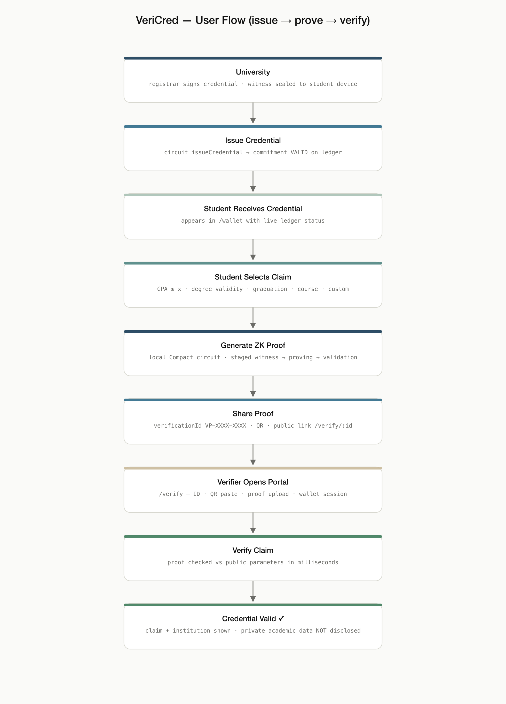

# VeriCred — User Flows



Three roles interact with VeriCred. Each flow below maps to real routes and
real circuits in the current implementation.

## University (issuer)

1. **Connect wallet** — Lace / 1AM via the dApp connector, or a demo session
   (header → wallet modal).
2. **Create credential** — `/universities?tab=issue`: student name, program,
   credential title, graduation year, and the cumulative GPA that becomes the
   *private witness*. Choose “Issue now” or “Queue for sign-off”.
3. **Issue credential** — runs the `issueCredential` circuit (institution-owner
   key assertion) and anchors the commitment on-chain; the UI records the tx.
4. **Monitor** — `/universities` Overview (issued / active / verification
   requests / proofs / revoked counters) and the Students table
   (`/universities?tab=students`) with live status badges.
5. **Revoke / suspend** — `/universities?tab=revocation`: search a credential,
   record a reason, confirm. `revokeCredential` is permanent; `suspendCredential`
   is reversible via `reinstateCredential`. Every transition is an on-chain status
   change and immediately affects proof verification.

## Student (holder)

1. **Receive credential** — issued credentials appear in `/wallet` with live
   ledger status (Active / Pending / Expired / Revoked).
2. **View credential** — `/credential/:displayId` shows the certificate sheet,
   the lifecycle timeline, a QR code, and the redacted privacy panel
   (identity / records shown as ████ — “only verified claims are disclosed”).
3. **Select what to prove** — `/proof` step 2: degree validity, GPA threshold
   (slider), graduation status, course completion, enrollment, or a custom claim.
4. **Generate proof** — staged animation while the circuit runs
   (witness → proving → validating). A threshold the private witness cannot meet
   fails honestly and discloses nothing.
5. **Share proof** — review the disclosed vs. concealed field lists, then share
   the `VP-XXXX-XXXX` verification id, public link, or QR.

## Verifier (relying party)

1. **Receive request** — a verification id, link, or QR from the student.
2. **Open portal** — `/verify` (tabs: Verification ID · Scan QR · Upload proof ·
   Wallet session).
3. **Submit proof** — enter/paste the id, upload a JSON proof artifact, or scan.
4. **Verify** — the claim is checked against public parameters and ledger status.
5. **See only the permitted claim** — result panel shows Credential valid ✓,
   degree, institution, the proven claim, and explicitly
   **“Private academic data: Not disclosed.”** A revoked/suspended/expired
   credential or expired proof fails with the reason. Public record: `/verify/:vid`.

## End-to-end demo path (no wallet required)

```text
/universities?tab=issue  → issue a credential
/wallet                  → see it Active
/proof?cred=<id>         → pick “GPA threshold ≥ 3.50” → generate → share
/verify                  → paste the VP-… id → Credential valid ✓
/universities?tab=revocation → revoke it
/verify                  → re-check the same id → now FAILS (revoked)
```
